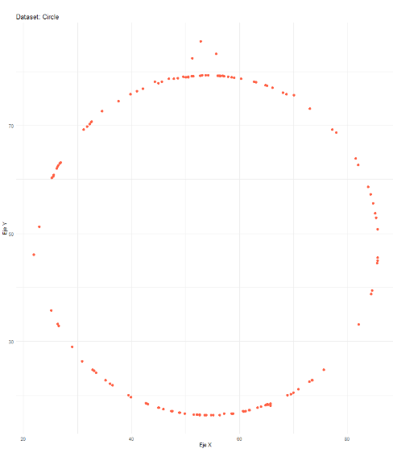
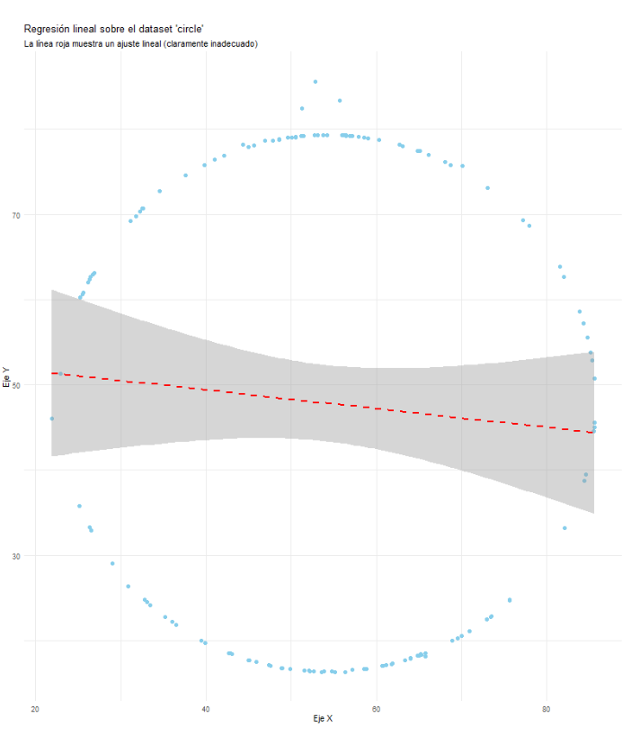

# Práctica 1

 **Estudiante:** Jonnathan Saquicela

## Introducción al Cuarteto Anscombe
### ¿Qué es el Cuarteto de Anscombe?

El **Cuarteto de Anscombe** es un conjunto de cuatro *datasets* (conjuntos de datos), cada uno compuesto por 11 pares de coordenadas (x, y). Fue creado en 1973 por el estadístico británico **Francis Anscombe**.

Su propósito fundamental es servir como una demostración pedagógica y una advertencia sobre las limitaciones de las estadísticas descriptivas simples y la importancia crítica de la **visualización de datos**.

### La Paradoja: Estadísticas Idénticas, Gráficos Distintos

La genialidad del cuarteto radica en que los cuatro conjuntos de datos son, desde un punto de vista estadístico-descriptivo, **casi idénticos**.

Si calculamos las propiedades estadísticas más comunes para cada uno de los cuatro datasets, obtenemos prácticamente el mismo resultado:

* **Media de X:** 9.0
* **Varianza de X:** 11.0
* **Media de Y:** 7.50
* **Varianza de Y:** 4.12 (con mínimas variaciones)
* **Coeficiente de correlación de Pearson (r) entre X e Y:** 0.816
* **Línea de regresión lineal (mínimos cuadrados):** $y \approx 3.00 + 0.50x$
* **Coeficiente de determinación ($R^2$):** 0.67

Basándose únicamente en estos números, un analista podría concluir erróneamente que los cuatro conjuntos de datos describen la misma relación lineal subyacente.

---

### La Revelación: El Poder de la Visualización

El "engaño" se revela en el momento en que los datos se grafican. A pesar de sus estadísticas idénticas, los gráficos de dispersión (scatter plots) de cada conjunto son drásticamente diferentes.

#### Descripción de cada Dataset

* **Dataset I:**
    * **Apariencia:** Es el "caso esperado". Muestra una nube de puntos razonablemente lineal, con una clara correlación positiva. La línea de regresión describe bien la tendencia general.

* **Dataset II:**
    * **Apariencia:** Los datos muestran una relación **no lineal** evidente (una curva parabólica).
    * **Lección:** La correlación lineal y la línea de regresión son completamente engañosas y no capturan la estructura real de los datos.

* **Dataset III:**
    * **Apariencia:** Muestra una relación lineal casi perfecta para 10 de los 11 puntos, pero con un **único valor atípico (outlier)** extremo en el eje Y.
    * **Lección:** Este único *outlier* es suficiente para "arrastrar" la línea de regresión y distorsionar el coeficiente de correlación, haciéndolos coincidir con el Dataset I.

* **Dataset IV:**
    * **Apariencia:** Es un caso extremo. 10 de los 11 puntos comparten el mismo valor de X (x=8), y un solo punto es un **punto de palanca (leverage point)** con un valor de X muy diferente (x=19).
    * **Lección:** Este único punto atípico en el eje X define por sí solo la pendiente de la línea de regresión. Sin él, la correlación sería indefinida (ya que no habría varianza en X).

### Conclusión e Impacto

La lección principal del Cuarteto de Anscombe se resume en una frase:

> **"Nunca confíes únicamente en los resúmenes estadísticos. ¡Siempre grafica tus datos!"**

El cuarteto subraya la necesidad fundamental del **Análisis Exploratorio de Datos (EDA)**. Antes de aplicar modelos estadísticos complejos, es esencial "mirar" los datos para:

1.  Identificar la estructura subyacente (lineal, no lineal, etc.).
2.  Detectar valores atípicos (outliers) influyentes.
3.  Validar si las suposiciones del modelo (ej. linealidad) son apropiadas.

Este concepto ha sido tan influyente que inspiró creaciones modernas como el **"Datasaurus Dozen"** (Docena del Datasaurio), que lleva la misma idea al extremo: doce datasets con estadísticas idénticas pero que, al graficarlos, forman figuras completamente distintas (como un dinosaurio, una estrella, etc.).

----
## Resultados 

### Visualización de los datos
El repositorio que me toco visualizar sus datos es el ``cyrcle``, a continuación los primeros 10 datos, del archivo [showDataset](src/showDataset.r):

| Nº | dataset |   x   |   y   |
|----|----------|-------|-------|
| 1  | circle   | 56.0  | 79.3  |
| 2  | circle   | 50.0  | 79.0  |
| 3  | circle   | 51.3  | 82.4  |
| 4  | circle   | 51.2  | 79.2  |
| 5  | circle   | 44.4  | 78.2  |
| 6  | circle   | 45.0  | 77.9  |
| 7  | circle   | 48.6  | 78.8  |
| 8  | circle   | 42.1  | 76.9  |
| 9  | circle   | 41.0  | 76.4  |
| 10 | circle   | 34.6  | 72.7  |

### Gráficas de los datos

A continuación la proyección de una gráfica acerca de los datos. Gráfica generada del archivo [showDataset](src/showDataset.r)

A continuación la imagen acerca de los datos más la proyección lineal. Gráfica generada del archivo [showGrafics](src/showGrafics.r)

